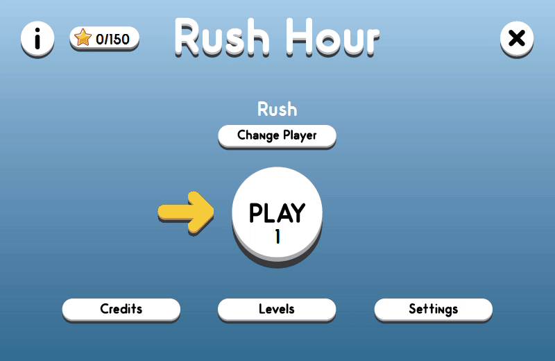

# Rush-Hour-OOP
Object Oriented Programming Term Project (Group of 3)

### What is Rush Hour?
Rush Hour is a sliding block logic game, which is considered as one of the best logic games of all time where your main goal is to lead the red car to the exit by moving the other vehicles on the map out of the way. In the original version of the game there are 40 challenges, ranging in difficulty, which will push the player to think strategically before making a move. Main goal is to implement the game with our own style in order to make the players have a better experience in virtual life when compared to playing in real life. To do this we have our own additions and changes made to the original Rush Hour game.

### How to Play
*  Try to lead the red car to the exit by moving the other vehicles on the map out of the way.
*  At the end of each level, you collect stars according to how well did you do in that level. The Less moves you make the more stars you collect.
*  Use your stars to unlock new and awesome themes.
*  You can use 2 Power-ups for help if you are stuck.
   * Poof: Select an obstacle to make it disappear.
   * Shrink: Select a 3 by 1 object to make it a 2 by 1 object.
   
### Download:  https://drive.google.com/drive/folders/1uNj-_B_aHopx0Ke7FK3beET0uh7FovGI?usp=sharing 
## Galery
            
